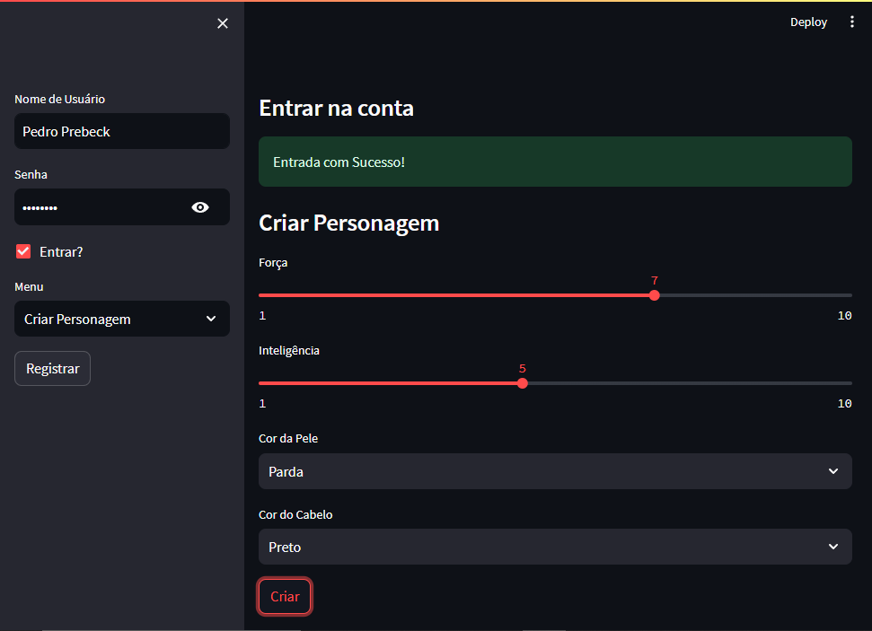

# 👾 Aplicativo de Criação de Personagens para RPG 👑

Bem-vindos, bravos aventureiros, ao **Aplicativo de Criação de Personagens para RPG**! 🎮🎉 Solte sua criatividade e embarque em uma jornada de customização de personagens usando o poder do Streamlit e a magia do SQLite.

## ✨ Recursos

- **Autenticação de usuário**: 🔒 Crie seu caminho registrando-se e fazendo login usando o nome de usuário e a senha secreta de sua escolha.
- **Criação de Personagem**: 🧙‍♂️ Crie seu personagem personalizando atributos como força, inteligência, cor da pele e cabelo.
- **Personalização de atributos**: ⚔️ Ajuste os atributos em uma escala mística de 1 a 10 para criar seu avatar perfeito.
- **Personalização Mágica**: ✨ Cada personalização está imbuída da sua essência, vinculada para sempre ao seu perfil único.
- **Veja sua criação**: 👁‍🗨 Contemple a tapeçaria dos atributos do seu personagem em toda a sua glória.
- **Runas de segurança antigas**: 🔐 Suas senhas são protegidas com poderosos encantamentos SHA-256 antes de serem armazenadas.

## 🚀 Como Embarcar

1. Clone este repositório encantado em seu reino.
2. Evoque o ritual de instalação: `pip install -r requirements.txt`.
3. Liberte a magia do Streamlit: `streamlit run app.py`.

## 📜 Crônicas de Código

Sua jornada é dividida em dois pergaminhos:

- `app.py`: Este grimório contém o coração dos encantamentos Streamlit. Ele combina autenticação de usuário, criação de personagem e visualização de atributos.
- `database.py`: Neste livro, você descobrirá os feitiços para criar usuários, forjar personagens e recuperar seus atributos misteriosos.

## 🌟 Primeiros passos

1. Chame um terminal e navegue até o diretório escolhido.
2. Pronuncie o encantamento para instalar os elementos necessários: `pip install -r requirements.txt`.
3. Lance o encantamento Streamlit: `streamlit run app.py`.

## 📣 Nota do Feiticeiro

Este é um mero vislumbre do potencial ilimitado que existe no mundo da feitiçaria de software. À medida que você continua sua jornada, considere aumentar a segurança, fortalecer as defesas contra erros e expandir o leque de recursos.

Aventure-se e que seus personagens sejam lendários para sempre! 🎭📜

Para qualquer dúvida ou enigma fascinante, envie um corvo para [Pedro Azevedo](mailto:pedroazevedo252@gmail.com). 🦉✉️